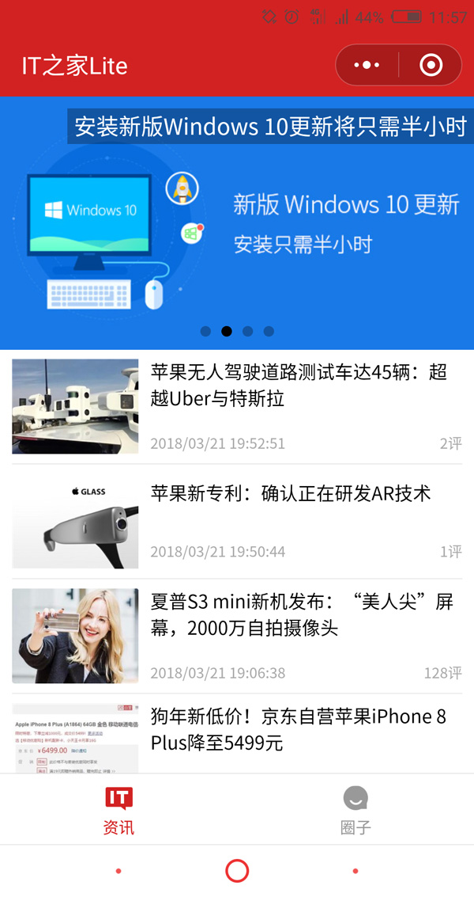
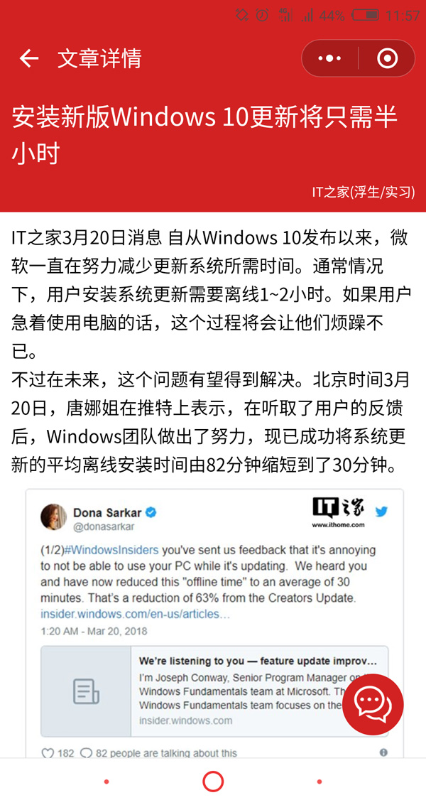
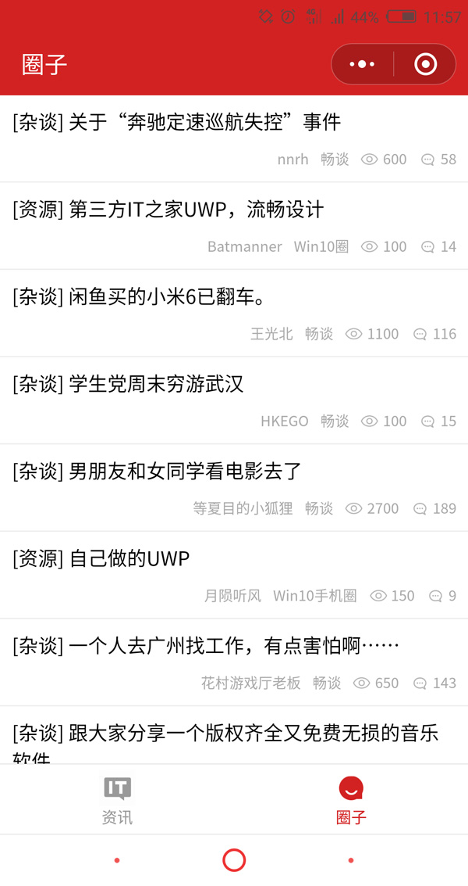

# ithome-lite

> IT之家第三方小程序版客户端（使用 uni-app 开发，多端兼容）

## 截图展示

<p>
  
  
  
</p>

## 项目模板

> [uni-app](https://uniapp.dcloud.io) 是一个使用 [Vue.js](https://vuejs.org) 开发跨平台应用的前端框架，开发者编写一套代码，可编译到iOS、Android、H5、小程序等多个平台。

``` bash
$ vue create -p dcloudio/uni-preset-vue my-project
```

## 运行步骤

* 安装依赖 `$ npm install`

* 编译运行
  - 网页 `$ npm run dev:h5`
  - 小程序 `$ npm run dev:mp-weixin`

* 生产构建
  - 网页 `$ npm run build:h5`
  - 小程序 `$ npm run build:mp-weixin`

* 查看调试
  - 小程序 使用微信开发者工具打开 `dist/dev/mp-weixin`
  - 网页 通过浏览器访问 `localhost:8080`

## 部分 api 列表

* 新闻列表 https://api.ithome.com/json/newslist/news?r=0
* 文章详情 https://api.ithome.com/xml/newscontent/350/412.xml
* 相关文章 https://api.ithome.com/json/tags/0350/350362.json
* 最热评论 https://dyn.ithome.com/json/hotcommentlist/350/87a8e5b144d81938.json
* 评论列表 https://dyn.ithome.com/json/commentlist/350/87a8e5b144d81938.json
* 评论详情 https://dyn.ithome.com/json/commentcontent/d739ee8f2ceb0a27.json
* 轮播新闻 https://api.ithome.com/xml/slide/slide.xml
* 圈子列表 https://apiquan.ithome.com/api/post?categoryid=0&type=0&orderTime=&visistCount&pageLength
* 圈子详情 https://apiquan.ithome.com/api/post/236076
* 圈子评论 https://apiquan.ithome.com/api/reply?postid=236076&replyidlessthan=3241294
