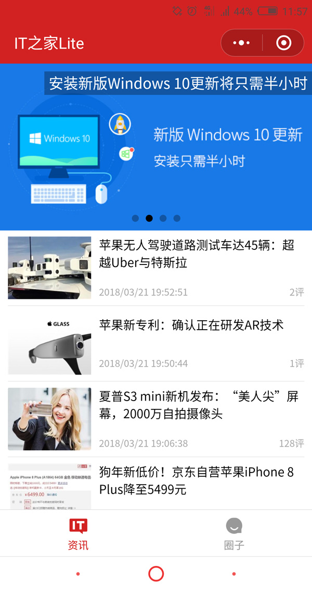
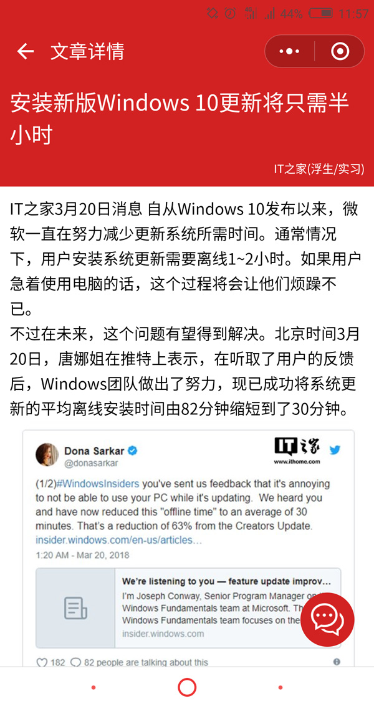
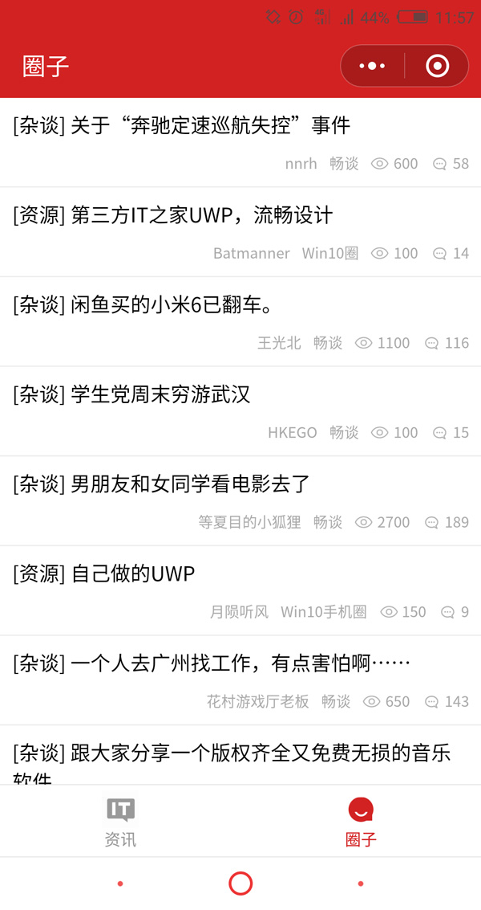

# ithome-lite

> IT之家第三方小程序版客户端

## 截图展示

<p>
  
  
  
</p>

## 项目模板

* [F-loat/mpvue-quickstart](https://github.com/F-loat/mpvue-quickstart) - 更优雅的 mpvue 起手式

``` bash
$ vue init F-loat/mpvue-quickstart my-project
```

## 运行步骤

* 安装依赖 `$ npm install`

* 编译运行
  - 小程序 `$ npm run dev`
  - 网页 `$ npm run dev:h5`

* 生产构建
  - 小程序 `$ npm run build`
  - 网页 `$ npm run build:h5`

* 查看调试
  - 小程序 使用微信开发者工具打开项目目录
  - 网页 通过浏览器访问 `localhost:8080`

## 相关依赖

* [flyio](https://github.com/wendux/fly) - 同时支持浏览器、小程序、Node、Weex 及快应用的基于 Promise 的跨平台请求库
* [mpvue-packager](https://github.com/F-loat/mpvue-packager) - 开箱即用的 mpvue 打包工具
* [mpvue-entry](https://github.com/F-loat/mpvue-entry) - 统一构建入口，无需冗余的 main.js 文件
* [mpvue-config-loader](https://github.com/F-loat/mpvue-config-loader) - 单文件页面配置，无需单独的 main.json 文件
* [mpvue-router-patch](https://github.com/F-loat/mpvue-router-patch) - 在 mpvue 中使用 vue-router 兼容的路由写法
* [xmlstring2json](https://github.com/vilien/xmlstring2json) - xml 字符串转换 json 格式，适用于微信小程序

## 部分 api 列表

* 新闻列表 https://api.ithome.com/json/newslist/news?r=0
* 文章详情 https://api.ithome.com/xml/newscontent/350/412.xml
* 相关文章 https://api.ithome.com/json/tags/0350/350362.json
* 最热评论 https://dyn.ithome.com/json/hotcommentlist/350/87a8e5b144d81938.json
* 评论列表 https://dyn.ithome.com/json/commentlist/350/87a8e5b144d81938.json
* 评论详情 https://dyn.ithome.com/json/commentcontent/d739ee8f2ceb0a27.json
* 轮播新闻 https://api.ithome.com/xml/slide/slide.xml
* 圈子列表 https://apiquan.ithome.com/api/post?categoryid=0&type=0&orderTime=&visistCount&pageLength
* 圈子详情 https://apiquan.ithome.com/api/post/236076
* 圈子评论 https://apiquan.ithome.com/api/reply?postid=236076&replyidlessthan=3241294
